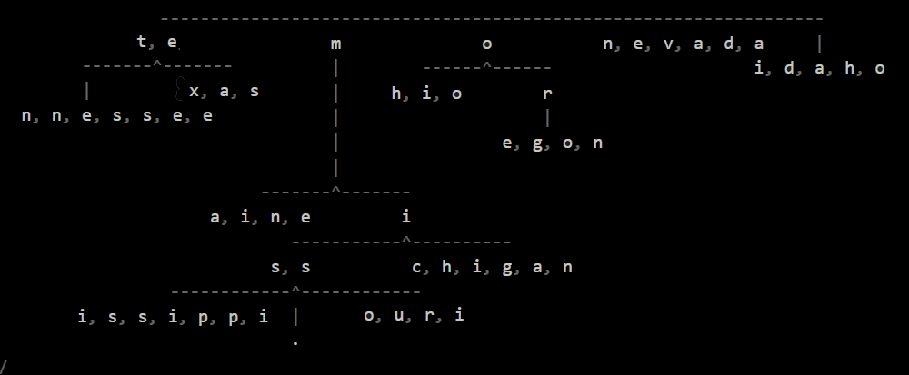

# RadixTrie JS

<p align="center">
  </img>
</p>

# Introduction

**RadixTrie JS** is a compressed trie data structure extending the **`@webkrafters/trie`** package class.

### Name:

<strong>@webkrafters/radix-trie</strong><br />
<strong>Alternate:</strong> radix-trie.js

# Installation

npm install --save @webkrafters/radix-trie

# Usage

```tsx
// imports default implementation of the radix-trie core.
import { DefaultImpl } from '@webkrafters/radix-trie';

const trie = new DefaultImpl<...>(...);
```

```tsx
// imports string-only implementation of the radix-trie core.
import { StringImpl } from '@webkrafters/radix-trie';

const trie = new StringImpl(...);
```

```tsx
// imports core radix-trie abstract class
import { Core } from '@webkrafters/radix-trie';

class CustomImpl<T> extends Core<T> {
  matches(...) : boolean { ... }
  merge(...) : void { ... }
}
```

# Implementations

This package contains **3** major items:
<ul>
  <li>A radix-trie core abstract class - to be exended as needed.</li>
  <li>Two out-of-the-box implementations:
    <ol>
      <li>a default implementation and </li>
      <li>a string-only implementation</li>
    </ol>
    of the abstract class.</li>
</ul>

## New method
### ViewInternalsAsNode Method.
```tsx
viewInternalsAsNode(): TrieableNode<T>;
```
This method produces a `TrieableNode` representation holding the data exactly as stored in the trie.

<b><i>Caveat:</i></b><br />

The returned trieable node is not the real value of the trie. Therefore, with the exeception of the `StringImpl` trie instance, it cannot be guaranteed to recreate an identical trie instance.

<b><i>Pro-tip:</i></b><br />

To obtain trieable node corresponding to the real value of the trie, please use the `asTrieableNode()` method.

## Abstract methods
The core abstract class contains **two** **`abstract`** methods. Although not expressly designated as *abstract* in the package due to Typescript and Javascript limitations, they require custom implementations.

This custom implementation requirement is enforced at runtime.

### 1. Matches Method.
```tsx
matches(...): boolean;
```
This method matches any body of data which can be supplied to the implementation's constructor to create a new instance identical to `this` instance.

### 2. Merge Method.
```tsx
merge(...): void;
```
This method merges any `Trie` instance and `TrieableNode` object into `this` instance as deemed compatible by its implementation. 

# More Reading

For the documentation on the rest of the properties and methods, please visit the base package documentation here:<br />

[https://github.com/webKrafters/trie.js/blob/master/docs.md](https://github.com/webKrafters/trie.js/blob/master/docs.md)

# License
MIT

